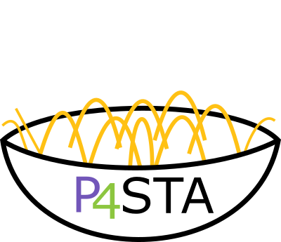
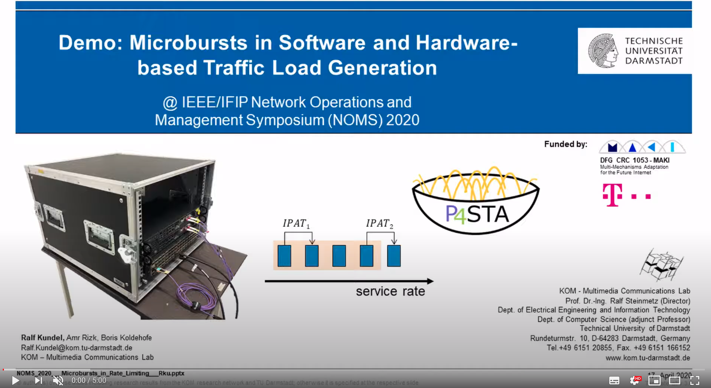
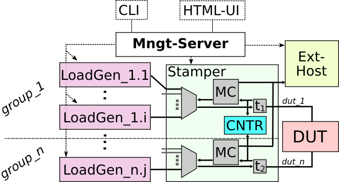
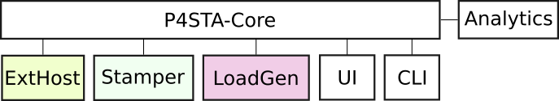

<p align="center">
<a href="https://github.com/ralfkundel/p4-codel/"></a>
</p>

# P4STA: High Performance Packet Timestamping and Load Aggregation Framework

P4STA is an open source framework that combines the flexibility of software data traffic load generation with the accuracy of hardware timestamping. P4STA enables a measurement accuracy of a few nanoseconds and zero packet loss detection using standard programmable hardware, i.e. mainly P4-targets (but also FPGAs).
The P4STA framework consists of:
* P4STA core implementation - orchestrating the functionalities
* CLI management interface
* HTML-UI management interface (recommended - same functionality as CLI)
* Hardware abstractions for different timestamping devices (called "Stamper")
* Loadgenerator abstractions
* Evaluation scripts for measurement series

<p align="center">
<a href="https://www.youtube.com/watch?v=KE4AZTF2ZJQ"></a>
</p>

## Supported Hardware
P4STA supports different Stamper targets, currently P4-BMv2, Barefoot Tofino and Netronome SmartNICs.
For each target there exists a subfolder in "stamper_targets". Further targets can be easily installed by copying the corresponding driver.

Currently supported Stamper Targets are:
* [P4-bmv2](stamper_targets/bmv2/README.md) reference implementation
* [Barefoot Tofino](stamper_targets/Wedge100B65/README.md)
* [Netronome NFP-SmartNICs](stamper_targets/netronome/README.md)

# Installation
P4STA needs to be run on Linux. For the management server Ubuntu 18.04 LTS is well tested but other versions should work as well (python3.6 (since Ubuntu 18.10) or newer is required).
For all other servers any Ubuntu version should work.
After cloning this repository on any server/machine (management server) in your testbed, ensure that:
1. Every server (loadgen servers, P4-device, external host) requires ssh pub key from management-server to allow a password-free SSH-connection
2. Execute the install script (./install.sh)
```
./install.sh
```
This setup script will install only the dependencies on the management server. All other servers will be installed later automatically.

3. After the installation you will be asked if you want to use the local Web-GUI (option: 1/2) or CLI (option: 3). If you choose the GUI it will be accessible in your browser at: http://MANAGEMENT-SERVER-IP:9997

The first time P4STA will automatically open the setup window. You can open this window also later to configure further servers with the construction tool in the top right of the html UI.

In this setup window:

  3.1. select the type of external host, stamper and load generator you want to setup. Disable categories you do not want to install.
  3.2. insert the IP addresses and user names for these servers (note: this should be the IP address in the management network which is accessible via ssh).
  3.3. check your configurations by the check button. If everything is green -> Click on the "Create Setup Script" button.
  3.4. Click on "Execute install_server.sh script!" button in the newly opened window. The CLI will ask you multiple time for your password on the server which will be currently installed (once for each server to be installed).
  3.5 after the script completes, you can close the window with "Finish" and start using P4STA. 
  
** Important:  For Intel Tofino ** 

1. it is required to stop P4STA in the CLI and restart it after installation. Otherwise the grpc drivers are not loaded correctly.
2. Compile the P4-Code of the stamper target on your P4-device. For details see the [Tofino readme](stamper_targets/Wedge100B65/README.md). For BMV2 (Mininet) and Netronome this is not necessary as this repository contains the compiler output.


# Using P4STA

You can start P4STA simply with the following script:
```
./run.sh
```
We highly recommonend to use the "status check" on the bottom of the configuration page before deployment in order to eliminate configuration faults.


# Publications
* "How to measure the speed of light with programmable data plane hardware?"@ 2nd P4Europe Workshop: [Demo Paper](https://ieeexplore.ieee.org/abstract/document/8901871)
* "P4STA: High Performance Packet Timestamping with Programmable Packet Processors"@ IEEE/IFIP NOMS: [Paper](https://ieeexplore.ieee.org/abstract/document/9110290)
* "Microbursts in Software and Hardware-based Traffic Load Generation" @IEEE/IFIP NOMS: [Demo Paper](https://ieeexplore.ieee.org/abstract/document/9110305)


# Architecture



P4STA testbeds consits of three main components:
1. **Load generation servers.** The number is $\ge 1$. Servers are arranged in n groups, each assigned to one Device Under Test (DUT)-port.
2. **Stamper device.** Connecting all load generation servers and the DUT with each other. Stamper is used for load aggregation, packet timestamping and counting packets.
3. **Device Under Test (DUT).** Object of investigation. The number of DUT-ports is equal to the number of server group ports.

Packets are generated by a load generator, timestamped (t1) by the Stamper, forwarded to the DUT, timestamped again (t2) by the stamper, and sent back to a corresponding loadgen.
These two timestamps enable latency time measurements.


## Routing
Packets, arriving at the Stamper from a load generator port, are forwarded to the DUT port which belongs to this server group.
Packets, arriving from a DUT-port, are forwarded to one server. If the forwarding mode is:
* **L1** only one server per group is allowed and all packets are forwarded to this server.
* **L2** based on the Ethernet destination address.
* **L3** based on the IPv4 destination address. (IPv6 forwarding is currently not supported)

## Timestamping
Timestamps are stored inside the packets. Either (1) in an additional TCP option field or (2) in the UDP payload.
A packet, entering the Stamper device after the DUT can be forwarded to the external host, which captures all packets including the timestamps.
A sampling "downscale" factor can be defined, which causes that only every n-th paket will be forwarded to the external host. 

## Software Components
P4STA core components are mostly based on Python. The HTML-UI is realized with Django and communication between Core and UI/CLI is based in RPyC.
Stamper implementations vary due to hardware specific constraints and P4_14, P4_16 and Verilog is used here.




